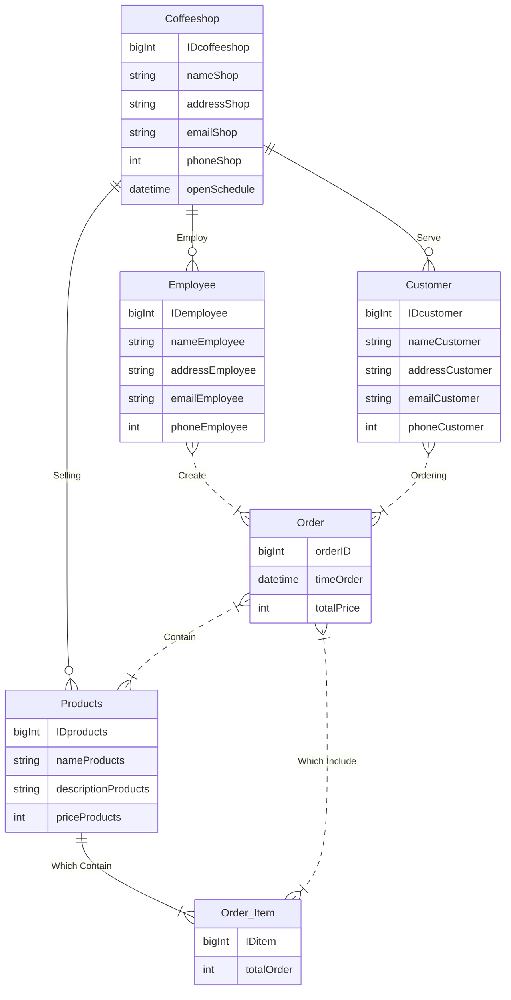
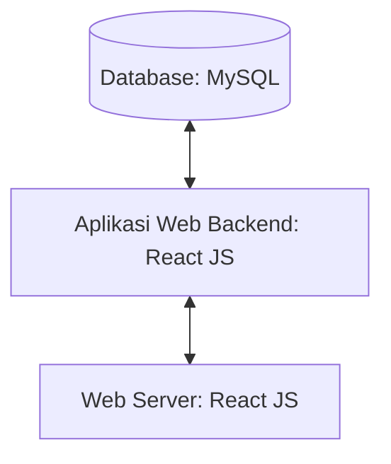

## 1.1 Latar Belakang

Dracoffee adalah website bisnis coffeeshop yang menyediakan informasi seputar kopi yang ada di kafe Dracoffee, produk yang dijual secara online sehingga pembeli bisa membelinya dari manapun dan juga beberapa informasi lainnya. Customer yang tertarik bisa melihat lokasi kafenya dan datang ke tempat secara langsung, juga bisa membeli product yang tersedia secara online.

## 1.2. Deksripsi Teknologi Informasi

Dracoffee memberikan pengalaman yang menarik bagi peminat kopi. Kami menyediakan pelayanan yang sangat mudah dan menarik, serta interaktif bagi konsumen kopi di coffeeshop kami. Website ini bertujuan memberikan kemudahan akses bagi mereka yang ingin menikmati secangkir kopi. Kami memberikan info yang detail serta menarik tentang produk kopi yang kami jual di kafe. Konsumen bisa mencari kopi favorit mereka melalui fitur search dan memberikan bintang atau rate terhadap produk-produk kami. Selain itu pelanggan juga bisa membeli kopi dari rumah, kantor, ataupun dimana saja dengan fitur delivery order. Bagi yang tertarik dengan kafe kami, juga sudah kita sediakan informasi lebih lanjut soal lokasi Dracoffee berada, sehingga konsumen tidak perlu lagi susah untuk pergi ke kafe kami. Selain itu kami juga menyediakan fitur untuk berbincang dengan pihak dari Dracoffee, jika ada hal yang ingin konsumen tanyakan secara daring. 

Teknologi yang akan saya gunakan untuk membuat dan mengembangkan website bisnis Dracoffee ini antara lain : 

•     HTML (Hypertext Markup Languange)

   HTML adalah bahasa markup standar untuk membuat halaman website. Bahasa ini berfungsi untuk membuat struktur website hingga menyusun format teks dan gambar pada halaman web

•     CSS (Cascade Style Sheet)

CSS adalah bahasa Cascading Style Sheet dan biasanya digunakan untuk mengatur tampilan elemen yang tertulis dalam bahasa markup, seperti HTML. CSS berfungsi untuk memisahkan konten dari tampilan visualnya di situs.

•     Javascript

JavaScript adalah bahasa pemrograman yang digunakan developer untuk membuat halaman web yang interaktif. Dari menyegarkan umpan media sosial hingga menampilkan animasi dan peta interaktif, fungsi JavaScript dapat meningkatkan pengalaman pengguna situs web. Sebagai bahasa skrip sisi klien, JavaScript adalah salah satu teknologi inti dari World Wide Web

•     React JS dan Bootstrap

React JS merupakan library JavaScript yang digunakan untuk membuat user interface (UI) website. React JS berisi library kode-kode JavaScript yang juga berfungsi untuk mempermudah dan mempercepat web development.

Bootstrap adalah framework web development berbasis HTML, CSS, dan JavaScript yang dirancang untuk mempercepat proses pengembangan web responsive dan mobile-first (memprioritaskan perangkat seluler).

•     Figma

Figma adalah salah satu tools atau aplikasi desain yang dapat digunakan pada windows dan Mac OS untuk membuat prototype aplikasi serta berbagai desain lainnya. Aplikasi ini berbasis vektor, sehingga memang sangat cocok digunakan untuk membuat user interface aplikasi atau website.

•     Visual Studio Code

Visual Studio Code adalah aplikasi code editor buatan Microsoft yang dapat dijalankan di semua perangkat desktop secara gratis. Kelengkapan fitur dan ekstensi membuat code editor ini menjadi pilihan utama para pengembang. Visual Studio Code bahkan mendukung hampir semua sistem operasi seperti Windows, Mac OS, Linux, dan lain sebagainya.

## 1.3. Branding

Pada tahap ini kita akan mengeksplorasi branding dari system yang dibuat. Branding meliputi :

•	Merk = Dracoffee (terinspirasi dari nama rasi bintang “Draco”)

•	Tagline = “ Behind every great day is a cup of coffee “

•	Campaign = Bagaimana membuat website yang menyediakan info bagi pembeli tentang bisnis dracoffee, maupun melakukan transaksi secara online agar memudahkan pembeli

•	Target User :

-	Usia 15+
    
-	Orang yang senang minum kopi
    
-	Orang yang ingin melihat referensi coffeeshop
    
-	Orang yang suka membeli barang (khususnya kopi) secara online
    
-	Orang yang sering mengeksplor coffeeshop
    
-	Orang yang ingin melihat menu sebelum datang ke coffeeshopnya
    
•	User Experience :
    
-	Mudah
   
-	Menarik
    
-	Sederhana
    
-	Menginspirasi
    
-	Warna : warna kopi (coklat), background hitam

• Inspirasi Desain :

## 2. User Story

Sebagai | Saya ingin bisa | Sehingga | Prioritas
---|---|---|---
Customer | Melihat Jadwal Operasional | Bisa mengetahui kapan coffeeshop buka dan bisa melayani customer | ⭐⭐⭐⭐
Customer | Mengklik Search | Bisa mencari produk yang diinginkan | ⭐⭐⭐⭐
Customer | Mengklik Navigation Bar di ukuran kecil | Pindah ke bagian tertentu dengan cepat | ⭐⭐⭐
Customer | Mengklik Lokasi Cafe | Melihat dimana letak lokasi Cafe | ⭐⭐⭐⭐
Customer | Melihat Menu di Kafe | Bisa melihat menu yang tersedia beserta hargany di kafe | ⭐⭐⭐⭐⭐
Customer | Melihat Rating dari Menu | Bisa mengetahui rating menu tertentu dari pelanggan lain | ⭐⭐⭐⭐
Customer | Melihat Product | Bisa melihat product yang dijual dan memilih product apa yang akan dibeli | ⭐⭐⭐⭐⭐
Customer | Mengklik Detail Product | Bisa memunculkan modal box yang berisi detail product | ⭐⭐⭐⭐
Customer | Mengklik "add to cart" | Bisa menambahkan produk ke shopping cart | ⭐⭐⭐⭐⭐
Customer | Mengklik "order now" | Bisa mengorder pesanan yang sudah dimasukan ke shopping cart | ⭐⭐⭐⭐⭐
Customer | Memasukan Informasi Customer | Bisa memproses order yang sudah dibuat | ⭐⭐⭐⭐⭐
Customer | Memasukan Alamat Pengiriman | Pesanan yang tadi dibuat bisa diantar ke alamat customer | ⭐⭐⭐⭐
Customer | Memilih Payment | Bisa membayar pesanan yang tadi sudah di order untuk diproses dan diantar | ⭐⭐⭐⭐⭐
Customer | Menerima "notifikasi" Order di Proses | Bisa mendapatkan info jikalau order sudah berhasil dibuat | ⭐⭐⭐⭐ 
Employee | Menangani Order | Bisa membuat dan memproses orderan yang dibuat oleh Customer | ⭐⭐⭐⭐⭐
Employee | Mengantar Order yang sudah dibuat | Bisa mengirim order yang sudah jadi dan dikirim ke customer | ⭐⭐⭐⭐
Employee | Memberikan "notifikasi" order sedang diantar | Bisa memberi tahu kepada client bahwa order sedang diantar ke lokasi | ⭐⭐⭐⭐
Customer | Menerima "notifikasi" order sudah sampai di tujuan | Bisa mendapatkan info bahwa orderan sudah sampai ke lokasi | ⭐⭐⭐⭐

## 3. Struktur Data

Berikut adalah struktur data Entity Relationship Diagram (ERP) dari project website coffeeshop saya : 

## 4. Arsitektur Sistem

## 5. Teknologi, Library, dan Framework

- UI/UX : Figma
- Text Editor : Visual Studio Code
- Web Languange : HTML, CSS
- Programming Languange : Javascript
- Database : MySQL
- Library : Feathericons & Bootstrap
- Framework : React JS

## 6. Desain User Experience dan User Interface
- Ini adalah link figma saya
  https://www.figma.com/file/2Q3f3SrSDHTnylwDSUJnJl/dracoffee-design?type=design&mode=design&t=ByOMLVuTpahXCXyJ-1
  
1. Ini adalah desain ui page website saya

 Ketika search di klik, akan keluar search bar
 
   

2. Tampilan page sudah responsive, dibawah adalah gambar page di ukuran smartphone.

     Navigation bar akan berpindah ke dalam navbar menu, ketika di klik akan memunculkan navbar

     

3. Dibawah tampilan page di bagian product

  - Ketika button mata di klik, akan muncul modal box yang menampilkan detail product
   
     

  - Ketika icon shopping cart di navbar di klik, akan muncul produk yang sudah ditambahkan ke shopping cart
   
      

## 7. Demonstrasi Video

Link youtube nya

## 8. Bagaimana mesin komputasi dan sistem operasi berperan dalam produk teknologi informasimu ?

   Mesin komputasi dan sistem operasi memainkan peran krusial dalam produk teknologi informasi kita. Mesin komputasi, yang mencakup perangkat keras seperti CPU, RAM, dan perangkat penyimpanan, bertanggung jawab untuk menjalankan operasi komputasi yang kompleks. Dalam hal ini, mesin komputasi berperan dalam memproses data dan menjalankan aplikasi perangkat lunak. 

   Sistem operasi, di sisi lain, adalah perangkat lunak yang mengelola sumber daya perangkat keras, memfasilitasi komunikasi antara perangkat keras dan perangkat lunak, serta menyediakan lingkungan untuk eksekusi aplikasi. Sistem operasi memastikan bahwa aplikasi dapat berjalan dengan efisien dan aman pada mesin komputasi. Oleh karena itu, mesin komputasi dan sistem operasi adalah fondasi dari produk teknologi informasi kita.

## 9. Bagaimana algoritma, struktur data, dan bahasa pemrograman berperan dalam produk teknologi informasimu ?

   Algoritma, struktur data, dan bahasa pemrograman adalah tiga komponen kunci dalam pengembangan produk teknologi informasi. Algoritma adalah panduan langkah-demi-langkah untuk menyelesaikan masalah atau menjalankan tugas tertentu. Mereka membentuk inti dari berbagai fungsi dan fitur dalam produk teknologi informasi. 

   Struktur data adalah cara penyimpanan, penyusunan dan pengaturan data di dalam media penyimpanan komputer sehingga data tersebut dapat digunakan secara efisien. Dalam penggunaan struktur data kali ini, saya akan menggunakan Entity Relationship Diagram (ERP). Entity Relationship Diagram (ERD) adalah suatu diagram yang digunakan untuk merancang suatu basis data, dipergunakan untuk memperlihatkan hubungan atau relasi antar entitas atau objek yang terlihat beserta atributnya.

   Bahasa pemrograman adalah bahasa manusia yang dimodifikasi sedemikian rupa sehingga bisa dimengerti oleh komputer untuk menjalankan tugas tertentu. Dalam produk saya kali ini, saya menggunakan Bahasa pemograman JavaScript untuk membangun website saya. Selain itu saya juga menggunakan HTML(Hypertext Markup Languange) dan CSS (Cascade Style Sheet) untuk membangun kerangka dasar website saya.

## 10. Bagaimana metode pengembangan perangkat lunak / Software Development Life Cycle berperan dalam produk teknologi informasimu ?

Proses Pembangunan Teknologi Informasi secara umum mengikuti Web Development Life Cycle 
   - Analysis
     
Analisis adalah tahapan ketika kita mencoba menganalisa website seperti apa akan dibuat
   -	Design
     
    	Setelah itu saya akan mencoba mendesain sketsa dari website saya, kemudian didesain lebih jelas menggunakan Figma
   -	Development

   Setelah berhasil mengupload websitenya, sekarang tinggal tahapan maintenance. Setelah mendeploy website untuk beberapa hari, saya akan mencoba cek apakah ada kerusakan atau pun kesalahan ketika mengakses website saya dari internet browser.
   - Testing & Review

     Setelah ketiga tahapan tadi, website yang sudah hamper selesai ditest terlebih dahulu, diperiksa semuanya dan dicari kesalahannya bila ada. Setelah itu saya mencoba meminta review ke orang lain untuk memberikan pendapat dan kritik mereka.
   - Deployment

     Setelah website saya dipastikan sempurna dan tidak ada kesalahan, juga sudah mendapatkan review yang baik, maka saya akan upload websitenya di akun github saya, yang kemudian akan saya hosting ke internet. Sehingga website saya bisa diakses melalui internet.
   - Maintenance

     Setelah berhasil mengupload websitenya, sekarang tinggal tahapan maintenance. Setelah mendeploy website untuk beberapa hari, saya akan mencoba cek apakah ada kerusakan atau pun kesalahan ketika mengakses website saya dari internet browser.

## 11. Bagaimana database / sistem basis data berperan dalam produk teknologi informasimu ?

   Database atau sistem basis data adalah komponen penting dalam produk teknologi informasi, terutama dalam hal penyimpanan dan pengelolaan data. Mereka berperan dalam menyimpan, mengorganisir, dan menyediakan akses ke informasi. Database memungkinkan aplikasi untuk menyimpan data secara persisten, yang berarti data tetap ada setelah aplikasi dimatikan. Mereka juga memungkinkan untuk melakukan pencarian, penyaringan, dan analisis data dengan efisien. 

 Selain itu, sistem basis data dapat menyediakan tingkat keamanan dan integritas data yang penting dalam aplikasi yang mengelola informasi sensitif. Dengan demikian, database berperan dalam memastikan bahwa data yang diperlukan untuk produk teknologi informasi dapat disimpan dan diakses dengan efisien dan aman.

