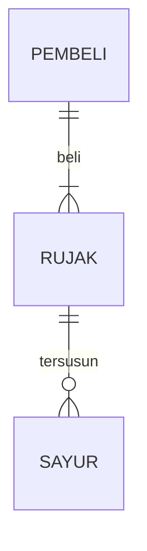

## 1.1 Latar Belakang

Disini saya akan membuat website bisnis yang bertemakan CoffeeShop. Didalam website ini akan terdapat homepage tentang café saya, menu yang disajikan, product yang bisa dibeli, dan info seputar café saya dan lokasinya. Selain itu pengguna bisa menggunakan fitur seperti navbar, search, add to cart, dll. 
     
Proses Pembangunan Teknologi Informasi secara umum mengikuti Web Development Life Cycle.

•	Analysis
Analisis adalah tahapan ketika kita mencoba menganalisa website seperti apa akan dibuat

•	Design
Setelah itu saya akan mencoba mendesain sketsa dari website saya, kemudian didesain lebih jelas menggunakan Figma

•	Development
Setelah desain dan menentukan teknologi apa saja yang akan digunakan, kemudian saya akan mencoba mengaplikasikan desain tadi ke kodingan. Mulanya saya akan membuat struktur dasar menggunakan HTML, kemudian diberikan style menggunakan CSS, dan terakhir untuk fitut atau interaksi pengguna menggunakan JavaScript.

•	Testing & Review
Setelah ketiga tahapan tadi, website yang sudah hamper selesai ditest terlebih dahulu, diperiksa semuanya dan dicari kesalahannya bila ada. Setelah itu saya mencoba meminta review ke orang lain untuk memberikan pendapat dan kritik mereka.

•	Deployment
Setelah website saya dipastikan sempurna dan tidak ada kesalahan, juga sudah mendapatkan review yang baik, maka saya akan upload websitenya di akun github saya, yang kemudian akan saya hosting ke internet. Sehingga website saya bisa diakses melalui internet.

•	Maintenance
Setelah berhasil mengupload websitenya, sekarang tinggal tahapan maintenance. Setelah mendeploy website untuk beberapa hari, saya akan mencoba cek apakah ada kerusakan atau pun kesalahan ketika mengakses website saya dari internet browser.

## 1.2. Deksripsi Teknologi Informasi

bla bla bla

## 1.3. Branding

Pada tahap ini kita akan mengeksplorasi branding dari system yang dibuat. Branding meliputi :
•	Merk = Dracoffee (terinspirasi dari nama rasi bintang “Draco”)
•	Tagline = “ Behind every great day is a cup of coffee “
•	Campaign = Bagaimana membuat website yang menyediakan info bagi pembeli tentang bisnis dracoffee, maupun melakukan transaksi secara online agar memudahkan pembeli
•	Target User :
    o	Usia 15+
    o	Orang yang senang minum kopi
    o	Orang yang ingin melihat referensi coffeeshop
    o	Orang yang suka membeli barang (khususnya kopi) secara online
    o	Orang yang sering mengeksplor coffeeshop
    o	Orang yang ingin melihat menu sebelum datang ke coffeeshopnya
    •	User Experience :
    o	Mudah
    o	Menarik
    o	Sederhana
    o	Menginspirasi
    o	Warna : warna kopi (coklat), background hitam

## 2. User Story

bla | bla | bla | bla
---|---|---|---
bla | bla | bla | ⭐⭐⭐⭐⭐

## 3. Struktur Data

Cara membuat aneka macam bentuk grafik menggunakan mermaid.js bisa lihat di [https://mermaid.js.org/syntax/entityRelationshipDiagram.html](https://mermaid.js.org/syntax/entityRelationshipDiagram.html) 

## 4. Arsitektur Sistem

Masih pake mermaid.js juga bisa lihat flowchart di [https://mermaid.js.org/syntax/flowchart.html](https://mermaid.js.org/syntax/flowchart.html)

## 5. Teknologi, Library, dan Framework

bla bla bla

## 6. Desain User Experience dan User Interface

Bisa load image 

## 7. Demonstrasi Video

Link youtube nya

## 8. Bagaimana mesin komputasi dan sistem operasi berperan dalam produk teknologi informasimu ?

Link youtube nya di detik jawaban ini

## 9. Bagaimana algoritma, struktur data, dan bahasa pemrograman berperan dalam produk teknologi informasimu ?

Link youtube nya di detik jawaban ini

## 10. Bagaimana metode pengembangan perangkat lunak / Software Development Life Cycle berperan dalam produk teknologi informasimu ?

Link youtube nya di detik jawaban ini

## 11. Bagaimana database / sistem basis data berperan dalam produk teknologi informasimu ?

Link youtube nya di detik jawaban ini
